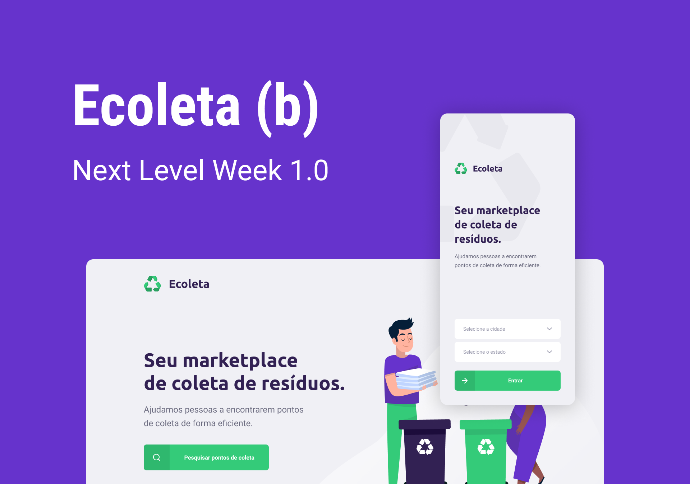

# Ecoleta - Marketplace de coleta de resíduos

Este projeto foi desenvolvido durante a Next Level Week da Rocketseat e tem propósito acadêmico.

O projeto consiste de três aplicaćões, um aplicativo React Native para que lista locais que coletam resíduos, uma aplicaćão React Web para cadastro dos pontos de coleta e um backend para atender as aplicaćões.
Todas aplicaćões foram feitas usando TypeScript.

## Backend
O backend é uma API Restfull feita com Node e Express, com rotas para listar e cadastrar pontos de coleta de resíduos.

Foi usado o banco SQLite através do Knex, onde existem migrations e seeds para setup inicial do banco de dados.

Para upload da imagem dos pontos de coleta, o backend usa o Multer.

Para validaćão de entrada, foi usado o Celebrate.

## Aplicaćão Web
A aplicaćão web feita com React é usada para cadastrar pontos de coleta.

Para se comunicar com o backend foi usado o Axios.

A funćão de mapa, usado no cadastro, foi feita com o LeafLeft. Para upload de imagem foi usado o Dropzone.

## Aplicaćão mobile
A aplicaćão mobile é onde o usuário do Ecoleta pode buscar os pontos de coleta.

A aplicaćão foi feita com React Native usando o Expo.

Foi usado o Axios para integrar com a API e o Expo Fonts para usar fontes do Google Fonts.

# Aprendizados
O que mais gostei foi trabalhar com TypeScript. A experiência foi muito boa, com certeza é algo que levar para o meu dia a dia.

Como já trabalho com React, o que mais gostei de fazer foi o backend. Usar o Express com Knex foi muito maneiro, vontade de sair criando mais endpoints.

# Experiência NLW da RocketSeat
A ordem é mão na massa, Diego que comanda as aulas vai explicando e fazendo.
Eu senti falta de mais explicaćões que ajudem os alunos a se virarem melhor. Exemplo, instalamos várias dependencias, seria legal ensinar como desinstalar, onde buscar e como entender estas dependências. Acho que este tipo de conteúdo ajudaria o aluno a se virar melhor depois sozinho.
